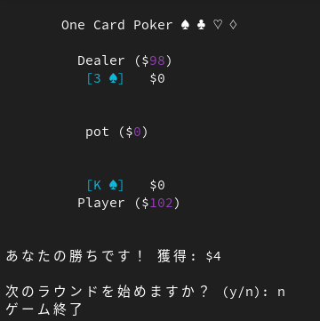

# One Card Porker

以下のようにコンパイルして実行してください。
```sh
gcc -o poker poker.c
./poker
```
<br>

<div>

</div>

<br>
遊び方:

p: パス
b: ベット
c: コール
f: フォールド

<br>


1. ゲームの概要:
   - プレイヤーとコンピューター(ディーラー)が1枚ずつカードを受け取ります。
   - 実際のお金は賭けません。

2. ルール:
   - カードのランク: 2, 3, 4, 5, 6, 7, 8, 9, T, J, Q, K, A
   - 最初に両者が$1のアンティ(強制ベット)を支払います。
   - プレイヤーが先にチェック(**パス**)か$1を**ベット**します。
   - その後、コンピューターが以下の選択をします:
     - プレイヤーが**ベット**した場合: **コール**するか**フォールド**する
     - プレイヤーが**パス**した場合: **パス**するか**ベット**する
   - コンピューターが**ベット**した場合、プレイヤーは**コール**か**フォールド**を選択できます。
   - 誰も**フォールド**しなければ、高いカード(2 < A)を持つ方がポットを獲得します。

3. 戦略的要素:
   - 不完全情報ゲーム。偶然性、複数のターンがあります。
   - 最適なプレイにはランダム化やブラフが必要です。

4. デッキ:
   - このバージョンでは13枚の単一スートのデッキを使用します。

<br>

### 参考資料

CMU School of Computer Science<br>
One-card poker<br>
http://www.cs.cmu.edu/~ggordon/poker/

